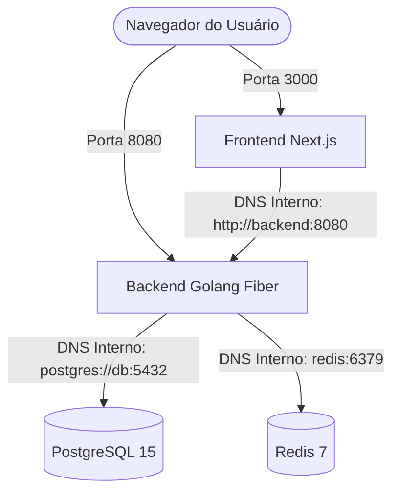

# Documentação de Infraestrutura: Containerização (Implementado)

## Visão Geral

A infraestrutura do **Client Support Hub** está totalmente containerizada e integrada. Esta documentação descreve a implementação final dos Dockerfiles multi-stage, a configuração do Docker Compose e os procedimentos para executar e monitorar os ambientes locais de desenvolvimento.

---

## Arquitetura de Containers e Fluxo de Rede

A solução é composta por 4 containers principais integrados na mesma rede Docker Bridge interna:



### 1. Banco de Dados (`db`)
* **Imagem**: `postgres:15-alpine`
* **Persistência**: Volume nomeado `pgdata` montado em `/var/lib/postgresql/data`.
* **Healthcheck**: Comando `pg_isready` executado a cada 5 segundos para atestar prontidão.

### 2. Cache e Sessão (`redis`)
* **Imagem**: `redis:7-alpine`
* **Persistência**: Volume nomeado `redisdata` montado em `/data`.

### 3. Backend API (`backend`)
* **Imagem de Produção**: Alpine minimal com binário estático compilado via Go.
* **Porta Exposta**: `8080` (HTTP).
* **Endpoint de Monitoramento (`GET /health`)**: Expõe em tempo real o status de conexão com PostgreSQL e Redis:
  * **Retorno de Sucesso (HTTP 200)**: `{"status":"healthy","services":{"database":{"status":"up"},"redis":{"status":"up"}}}`
  * **Retorno de Erro (HTTP 503)**: Caso algum banco caia, retorna status de falha com código 503.

### 4. Frontend Web App (`app`)
* **Imagem de Produção**: Node standalone otimizada com Next.js standalone.
* **Porta Exposta**: `3000` (HTTP).
* **Comunicação**: Utiliza a variável de build `NEXT_PUBLIC_API_URL` para realizar fetchs no Backend.

---

## Estratégias de Build Multi-Stage (Produção)

Para ambientes produtivos, o projeto adota receitas de Dockerfile com foco em otimização de tamanho de imagem e segurança:

### Backend (Golang)
* **Estágio 1 (Builder)**: Utiliza `golang:alpine`. Compila o binário estaticamente sem CGO (`CGO_ENABLED=0`) e aplica remoção de símbolos de debug (`-ldflags="-s -w"`). Instala o Goose para rodar migrations.
* **Estágio 2 (Runner)**: Copia apenas o binário final compilado, os arquivos de configuração do Viper e as migrations para uma imagem `alpine:latest` limpa.
* **Resultado**: Imagem final com menos de **50MB**.

### Frontend (Next.js)
* **Estágio 1 (Deps)**: Instala apenas dependências limpas de produção via `npm ci`.
* **Estágio 2 (Builder)**: Executa `npm run build` utilizando `output: 'standalone'` definido no `next.config.mjs`.
* **Estágio 3 (Runner)**: Copia apenas as pastas `.next/standalone`, `.next/static` e `public` para um container de Node 18 Alpine.
* **Resultado**: Imagem final com cerca de **150MB**.

---

## Diretrizes de Segurança (Hardening)

1. **Usuários Não-Privilegiados**: Nenhum container de aplicação roda sob privilégios de `root` (UID 0) em produção. O Frontend utiliza o usuário nativo `nextjs` e o Backend utiliza o usuário `appuser` criado no build.
2. **Isolamento de Redes**: As portas das persistências (`5432` do Postgres e `6379` do Redis) são abertas apenas para desenvolvimento local e protegidas dentro da rede virtual Bridge interna em produção.
3. **Imagens Base Alpine**: Reduz o vetor de CVEs por não conter ferramentas e utilitários supérfluos no runtime final do container.

---

## Guia de Execução e Comandos locais

Os comandos de orquestração de infraestrutura local são automatizados através do [Makefile](file:///Users/gedalias.caldas/Documents/client-suport/Makefile):

* **Iniciar a infraestrutura completa**:
  ```bash
  make infra
  ```
  *(Equivale a `docker-compose up -d --build`, levantando banco de dados, redis, rodando migrações automáticas e subindo o backend e frontend).*

* **Finalizar serviços mantendo volumes**:
  ```bash
  make down
  ```
  *(Para todos os containers sem deletar os dados persistidos no Postgres e Redis).*

* **Resetar e limpar infraestrutura**:
  ```bash
  make clean
  ```
  *(Remove containers, redes associadas e apaga totalmente os volumes nomeados `pgdata` e `redisdata` para um reset completo).*

---

## Deploy e Produção (Docker Swarm)

Para obter detalhes sobre o deploy em produção, publicação de imagens no registry privado e orquestração de stack com Docker Swarm, acesse o [Guia de Deploy (Docker Swarm)](file:///Users/gedalias.caldas/Documents/client-suport/docs/deploy-swarm.md).

