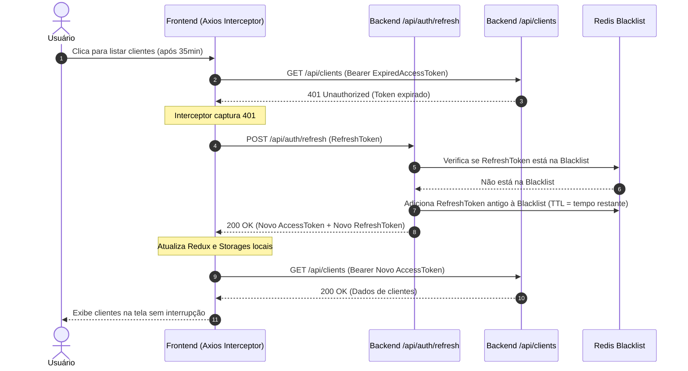
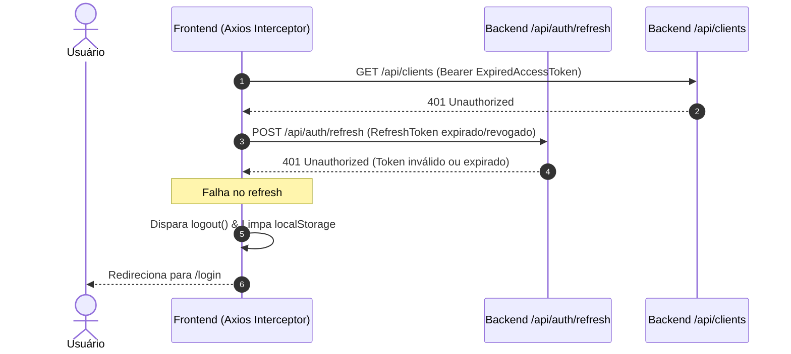

# Flow Specification: Autenticação Persistente e Renovação de Sessão (Refresh Token)

## Fluxo Completo de Renovação Transparente (Silent Refresh)

## Fluxo de Sessão Definitivamente Expirada ou Revogada

