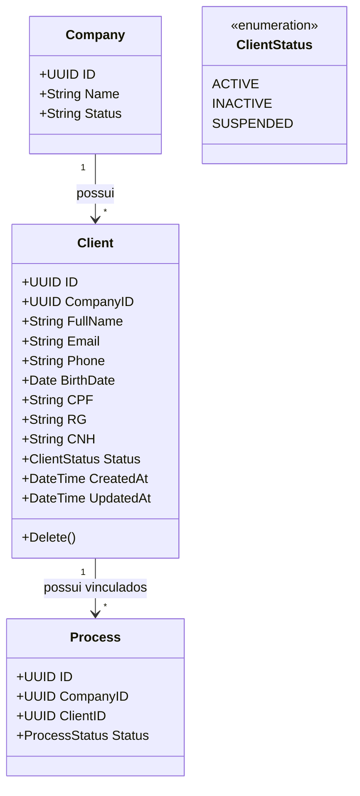

# Domain Specification: Client CRUD

Este documento descreve o modelo de domínio do CRUD de Clientes, mapeando entidades, agregados, objetos de valor e regras de negócio essenciais.

---

## 1. Agregado de Clientes

O agregado `Client` pertence ao Bounded Context de **Suporte ao Cliente**.

---

## 2. Entidades e Objetos de Valor

### 2.1. Entidade: `Client`
Representa um cliente cadastrado por uma empresa para receber atendimento.
* **Identidade**: Identificador único gerado por `UUIDv4`.
* **Multi-Tenancy**: Sempre vinculado a uma única `Company`.
* **Atributos de Identificação Opcionais**: E-mail, CPF, RG, CNH. Devem ser validados como únicos dentro do escopo daquela empresa.
* **Atributos de Data**: `BirthDate` (tipo DATE, sem horas), `CreatedAt` e `UpdatedAt` (timestamps UTC).

### 2.2. Estado: `ClientStatus` (Enum)
Controla o ciclo de vida do cliente no sistema.
* **ACTIVE**: Cliente ativo, habilitado a participar de novos processos ou atendimentos.
* **INACTIVE**: Cliente inativado (soft deleted). Não pode ser associado a novos processos.
* **SUSPENDED**: Cliente suspenso temporariamente.

---

## 3. Regras de Negócio do Domínio

### RN1: Multi-Tenancy e Isolamento
Qualquer consulta, cadastro, atualização ou desativação de um cliente está obrigatoriamente vinculada a uma `CompanyID` extraída da sessão JWT do usuário operador. É estritamente proibido expor ou modificar clientes entre tenants distintos.

### RN2: Unicidade Escopada por Empresa
Os seguintes campos, se fornecidos, não podem se repetir para clientes diferentes cadastrados na **mesma** empresa:
* **E-mail** (`email`)
* **CPF** (`cpf`)
* **RG** (`rg`)
* **CNH** (`cnh`)

Se o cliente A já possui o CPF X, o cliente B na mesma empresa não pode ser salvo com o CPF X. Caso o valor inserido seja vazio ou `NULL`, a restrição de unicidade não deve disparar (o banco de dados PostgreSQL permite múltiplos valores `NULL` sob índices `UNIQUE`).

### RN3: Regra de Integridade de Processos Vinculados (Bloqueio de Remoção)
Um cliente não pode ser desativado ou deletado do sistema se possuir qualquer processo associado a ele (`processes` referenciando `client_id` na mesma empresa).
Essa validação deve ser feita verificando a existência de registros na tabela `processes` vinculados àquele `client_id` e `company_id`. Caso exista, a operação de desativação/deleção é rejeitada lançando um erro de domínio.

### RN4: Exclusão Lógica (Soft Delete)
A remoção de um cliente deve alterar seu status para `INACTIVE`. O registro físico permanece no banco de dados para fins de auditoria e consistência histórica de processos que já ocorreram no passado.
