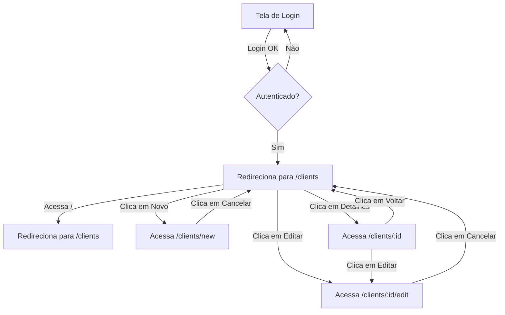
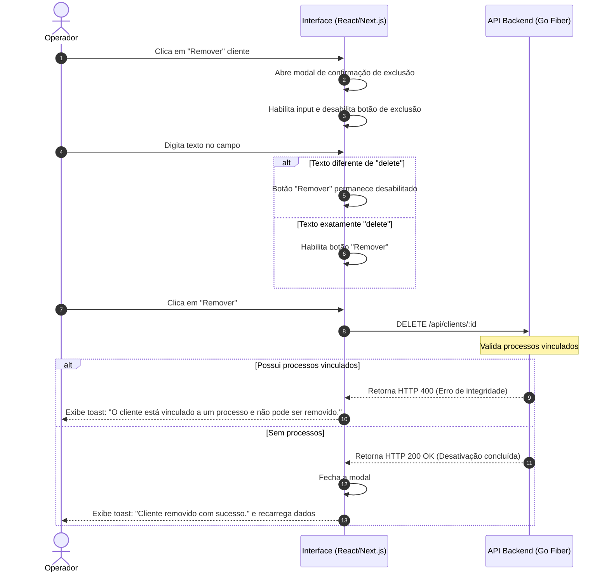

# Flow Specification: Client CRUD

Este documento mapeia os fluxos de navegação e as interações dinâmicas entre o usuário, o frontend e o backend para o CRUD de Clientes.

---

## 1. Fluxo de Navegação e Acesso Inicial

### 1.1. Login e Redirecionamento
1. O usuário insere suas credenciais na rota `/login`.
2. Após o login bem-sucedido, o token JWT é armazenado na store do Redux (e o refresh token no `localStorage` se a opção "Manter-me logado" for selecionada).
3. O hook `useAuth` realiza o redirecionamento imediato para a listagem principal na rota `/clients`.

---

## 2. Fluxo de Validação e Envio de Formulários (Criação/Edição)

1. O operador preenche os campos do formulário.
2. Ao digitar, o telefone e o CPF aplicam máscaras em tempo real na tela.
3. Ao clicar em "Salvar":
   * O frontend intercepta o envio e valida se o campo obrigatório `full_name` está preenchido.
   * Se inválido, destaca o input e bloqueia a submissão.
   * Se válido, remove a formatação das máscaras do CPF e do Telefone (extrai apenas os dígitos).
   * O frontend realiza a requisição POST (criação) ou PUT (edição) contendo os dados sanitizados.
4. O backend recebe a requisição:
   * Valida novamente os dados.
   * Executa a query de validação de unicidade de e-mail, CPF, RG e CNH para a mesma empresa (e excluindo o ID atual se for edição).
   * Se houver algum conflito, retorna status `409 Conflict` com o erro apropriado.
   * Se tudo estiver correto, persiste o registro no banco de dados e retorna status `201 Created` ou `200 OK`.
5. O frontend recebe a resposta do backend:
   * Se sucesso, exibe toast verde de confirmação e navega de volta para `/clients`.
   * Se erro 409, exibe mensagem vermelha focada no documento em conflito ("Este CPF já está cadastrado...").
   * Se outro erro, exibe mensagem genérica de erro.

---

## 3. Fluxo de Remoção com Modal de Segurança

