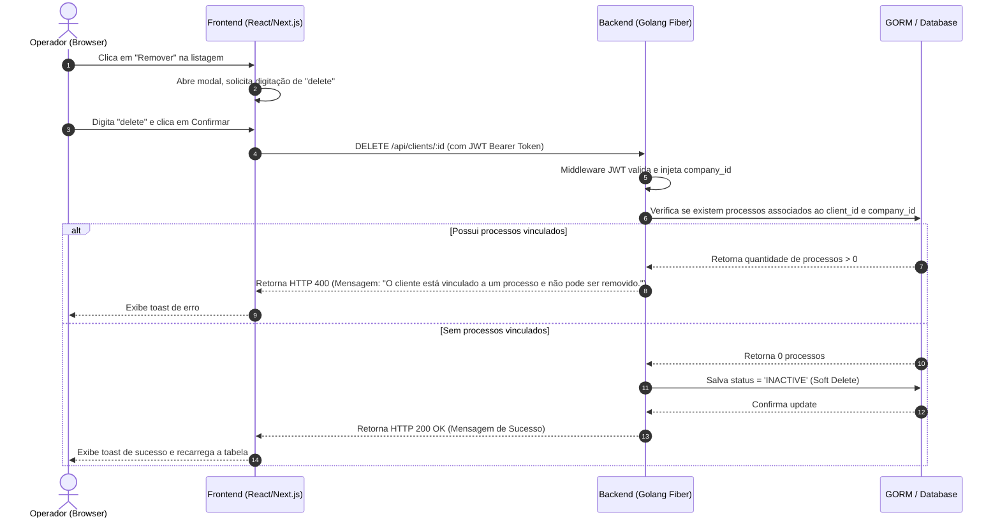

# Technical Specification: Client CRUD

Este documento especifica a arquitetura técnica, organização de pastas, dependências e fluxo de dados do CRUD de Clientes.

---

## 1. Arquitetura Geral do Sistema

A feature é implementada usando uma arquitetura baseada em Clean Architecture no backend e uma estrutura baseada em Features (Vertical Slices) no frontend.



---

## 2. Implementação no Backend (Golang)

### 2.1. Alteração no `ClientService`
O serviço `ClientService` (em `backend/internal/service/client.go`) precisa estender suas dependências para incluir o repositório de processos.
* **Nova Dependência**: `processRepo domain.ProcessRepository`
* **Construtor**: Atualizar `NewClientService` para receber `processRepo`.
* **Fluxo de Inicialização**: Atualizar `backend/cmd/api/main.go` para passar `processRepo` ao instanciar o serviço.
* **Alteração no Método `Delete`**:
  * Chamar o `processRepo.FindAll` com filtros `clientID = &id` e `companyID` para obter processos cadastrados.
  * Se a busca retornar registros (total > 0), abortar a deleção e retornar o erro `errors.New("O cliente está vinculado a um processo e não pode ser removido.")`.
  * Se não houver processos, prosseguir com a desativação: atualizar status do cliente para `INACTIVE` e salvar.

### 2.2. Alteração no `ClientHandler`
No handler (em `backend/internal/handlers/http/client_handler.go`):
* O método `Delete` deve interceptar o erro retornado pelo `ClientService.Delete`.
* Se o erro for `"O cliente está vinculado a um processo e não pode ser removido."`, retornar `c.Status(fiber.StatusBadRequest).JSON(fiber.Map{"error": err.Error()})`.

---

## 3. Implementação no Frontend (Next.js)

### 3.1. Estrutura do Módulo de Clientes (`app/src/features/clients`)
Criar a feature seguindo a arquitetura padrão do projeto:
```text
app/src/features/clients/
├── components/     # Componentes específicos de clientes
│   ├── ClientForm.tsx       # Formulário unificado de criação/edição
│   ├── ClientTable.tsx      # Tabela com cabeçalhos ordenáveis
│   ├── ClientFilters.tsx    # Filtros e barra de busca
│   └── ClientDeleteModal.tsx # Modal de confirmação digitando "delete"
├── hooks/          # Hooks customizados para gerenciar lógica
│   └── useClients.ts
├── pages/          # Páginas renderizadas
│   ├── ClientListPage.tsx
│   ├── ClientCreatePage.tsx
│   ├── ClientDetailPage.tsx
│   └── ClientEditPage.tsx
└── services/       # Comunicação com a API
    └── client.service.ts
```

### 3.2. Roteamento do Next.js (App Router)
Criar os diretórios em `app/src/app` para mapear as rotas da interface:
* `app/src/app/clients/page.tsx` -> Carrega o `ClientListPage`
* `app/src/app/clients/new/page.tsx` -> Carrega o `ClientCreatePage`
* `app/src/app/clients/[id]/page.tsx` -> Carrega o `ClientDetailPage`
* `app/src/app/clients/[id]/edit/page.tsx` -> Carrega o `ClientEditPage`

### 3.3. Configuração de Redirecionamento Pós-Login
No arquivo de rota do login (`app/src/app/login/page.tsx`), redirecionar o usuário para `/clients` em vez de `/dashboard` ao fazer o login de forma bem-sucedida.

---

## 4. Padrões Obrigatórios
1. **Sem placeholders**: Todas as telas e campos devem ser funcionais e estar perfeitamente integrados com as APIs reais.
2. **Formatação de Dados**:
   * O telefone deve ser exibido na tabela e detalhes mascarado como `(XX) XXXXX-XXXX` ou `(XX) XXXX-XXXX`.
   * O CPF deve ser exibido mascarado como `XXX.XXX.XXX-XX`.
   * As datas devem ser exibidas em formato local com base no fuso horário do navegador usando `Intl.DateTimeFormat` ou similar.
3. **Sem comentários**: Evitar adição de comentários supérfluos no código do backend e frontend, mantendo o código limpo, autoexplicativo e modular.
