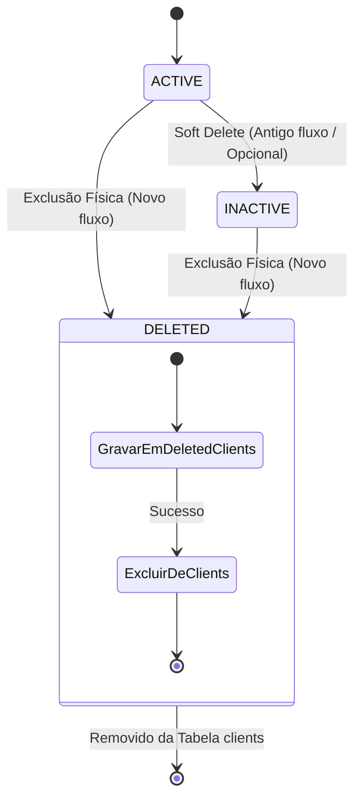

# Domain Specification: Client Delete

Este documento define os agregados, entidades, regras de domínio e transições de estado associados à exclusão e arquivamento de clientes.

---

## 1. Entidades e Value Objects

### 1.1. Entidade: `DeletedClient`
Representa o histórico de um cliente que foi fisicamente excluído do sistema principal.

* **Atributos**:
  * `ID`: Identificador sequencial (`int64`, autoincremento).
  * `Data`: Payload JSON contendo a cópia do estado da entidade `Client` no momento da exclusão.
  * `DeletedAt`: Data e hora exatas em que a exclusão ocorreu (com fuso horário UTC).

---

## 2. Regras de Negócio e de Domínio

### 2.1. Invariantes de Negócio
1. **Regra de Não-Vínculo (Integridade Referencial)**:
   * `Client` não pode ser excluído se existir qualquer entidade `Process` que faça referência a ele.
   * Expressão de Domínio:
     $$\forall p \in Processes, p.ClientID \neq Client.ID$$

2. **Garantia de Arquivamento**:
   * Um `Client` não pode ser removido da tabela de origem sem que seus dados completos de cadastro estejam devidamente inseridos e persistidos na tabela `deleted_clients`.

---

## 3. Transição de Estados

