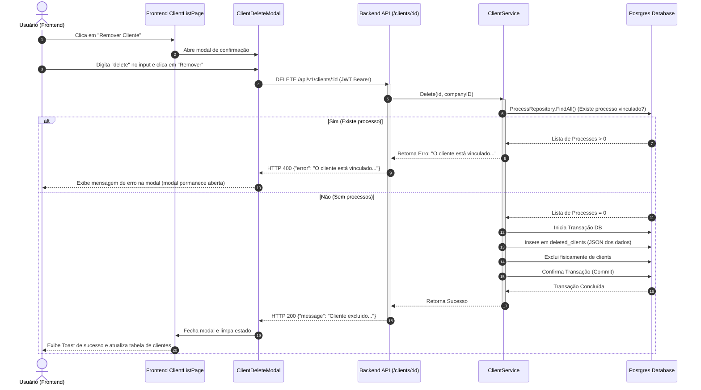

# Flow Specification: Client Delete

Este documento detalha o fluxo de controle fim-a-fim, interações entre Frontend e Backend e as transições de controle na exclusão de clientes.

---

## 1. Fluxograma Fim-a-Fim (Cenário Feliz vs. Triste)

