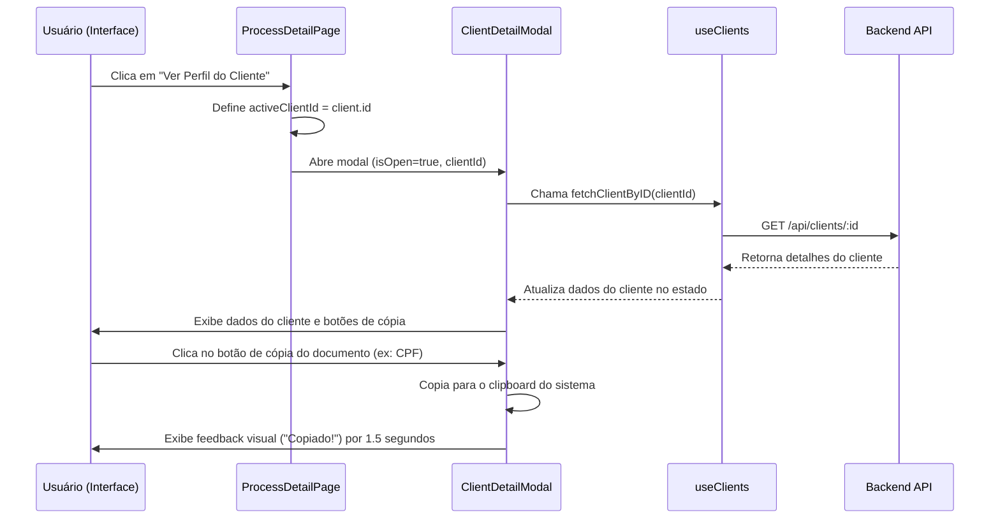

# Flow Spec: Client Profile Modal in Process Details

## Fluxo de Interação do Usuário

```mermaid
sequenceDiagram
    participant User as Usuário (Interface)
    participant Page as ProcessDetailPage
    participant Modal as ClientDetailModal
    participant Hook as useClients
    participant API as Backend API

    User->>Page: Clica em "Ver Perfil do Cliente"
    Page->>Page: Define activeClientId = client.id
    Page->>Modal: Abre modal (isOpen=true, clientId)
    Modal->>Hook: Chama fetchClientByID(clientId)
    Hook->>API: GET /api/clients/:id
    API-->>Hook: Retorna detalhes do cliente
    Hook-->>Modal: Atualiza dados do cliente no estado
    Modal->>User: Exibe dados do cliente e botões de cópia

    User->>Modal: Clica no botão de cópia do documento (ex: CPF)
    Modal->>Modal: Copia para o clipboard do sistema
    Modal->>User: Exibe feedback visual ("Copiado!") por 1.5 segundos
```
