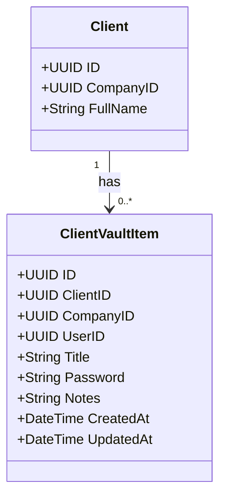

# Domain Spec: Client Credentials Vault

## Bounded Context
Gestão de Clientes (Client Management)

## Agregados e Entidades
O item do cofre (`ClientVaultItem`) pertence ao agregado de `Client`.

### Entidade: `ClientVaultItem`
Representa um item do cofre de credenciais de um cliente.

- **ID**: UUID v4 (Chave Primária)
- **ClientID**: UUID v4 (FK para `Client`)
- **CompanyID**: UUID v4 (FK para `Company`)
- **UserID**: UUID v4 (FK para `User` - operador que criou/modificou a credencial)
- **Title**: String (Nome do item, ex: "Portal e-CAC") - texto claro, não-sigiloso.
- **Password**: String (Encriptado no DB, decriptado ao carregar sob demanda)
- **Notes**: String (Encriptado no DB, decriptado ao carregar sob demanda)
- **CreatedAt**: DateTime
- **UpdatedAt**: DateTime

## Regras de Domínio
1. **Obrigatoriedade**: Um item do cofre deve ter obrigatoriamente um `Title` e uma `Password`.
2. **Encriptação Automática**: Sempre que a entidade for salva (Create ou Update), os campos sensíveis (`Username`, `Password`, `Notes`) devem ser persistidos encriptados.
3. **Descriptografia sob Demanda**: Os campos sensíveis devem ser decriptados no momento do envio ao cliente que tenha permissão e tenha requisitado o detalhamento da credencial.
