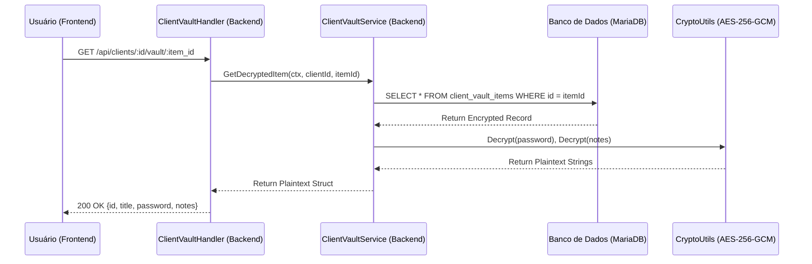

    User->>API: POST /api/clients/:id/vault {title, password, notes}
    API->>Service: CreateVaultItem(ctx, clientId, data)
    Service->>Crypto: Encrypt(password), Encrypt(notes)
    Crypto-->>Service: Return Encrypted Hex Strings
    Service->>DB: INSERT INTO client_vault_items
    DB-->>Service: Ok (Saved)
    Service-->>API: Return Created Item (sensitives masked/hidden)
    API-->>User: 201 Created {id, title}
```

## Fluxo de Revelação (Decriptação)

