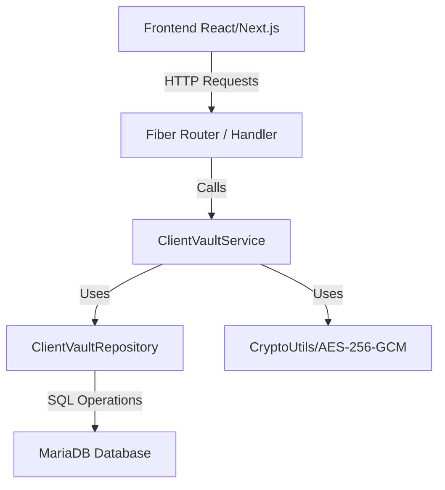

# Tech Spec: Client Credentials Vault

## Arquitetura Técnica
A feature será integrada de acordo com a arquitetura Clean/Hexagonal do backend em Go e a estrutura por features do frontend React/Next.js.

## Divisão de Camadas

### Backend
1. **Domain Layer**:
   - Adição da struct `ClientVaultItem` em `internal/domain/client_vault.go`.
   - Interface `ClientVaultRepository` no mesmo arquivo.
2. **Infrastructure Layer (Repository)**:
   - Implementação em `internal/repository/postgres/client_vault_repository.go` (usando GORM e compatível com MariaDB).
3. **Service Layer**:
   - `ClientVaultService` para lidar com encriptação, validações de negócio, delegação de persistência e validações de company.
4. **Handlers (HTTP Layer)**:
   - `ClientVaultHandler` em `internal/handlers/http/client_vault_handler.go`.
   - Mapeamento de rotas em `cmd/api/main.go`.

### Criptografia (Crypto Layer)
- Implementar algoritmo **AES-256-GCM** em `pkg/utils/crypto.go`.
- Chave de encriptação de 32 bytes gerada a partir do hash SHA-256 do `JWT_SECRET` (para conveniência se `VAULT_KEY` não for especificado).
- Geração de um IV (Initialization Vector) / Nonce único e criptograficamente seguro para cada operação de encriptação, armazenando o Nonce concatenado com a mensagem cifrada ou em separado. A concatenação `nonce + ciphertext` é o padrão recomendável para armazenar em um único campo TEXT/VARCHAR.
