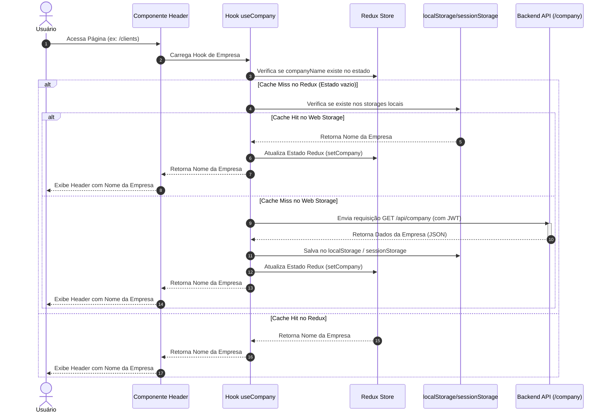
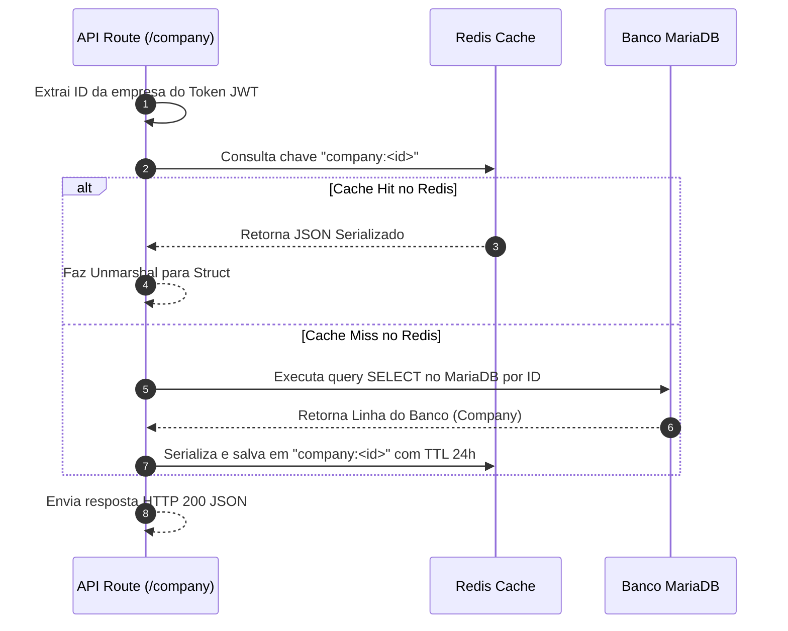

# Especificação de Fluxo: Exibição de Empresa e Decisões de Cache

Este documento mapeia os fluxos do sistema para obter e exibir os dados da empresa na interface, especificando quando os caches de frontend e backend são acionados.

---

## 1. Fluxo de Inicialização do Header (Montagem)

---

## 2. Fluxo Interno de Cache no Backend (API `/company`)

---

## 3. Fluxo de Limpeza de Cache no Logout

1. O usuário clica no botão "Sair".
2. O frontend chama o endpoint `/api/auth/logout` para invalidar a sessão no backend (colocando o token de acesso na blacklist).
3. Ao mesmo tempo, o frontend dispara a action `logout` do Redux.
4. O reducer do `authSlice` redefini todos os estados em memória para nulo e apaga os itens do storage físico do navegador:
   * `accessToken`
   * `companyName`
5. A aplicação redireciona o usuário para a tela de login.
