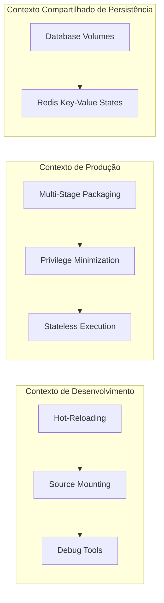
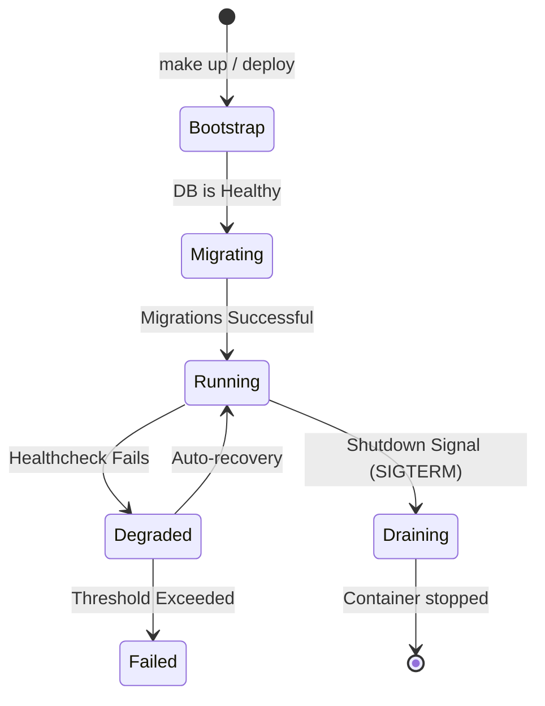

# Domain Specification: Containerização de Frontend e Backend

Este documento mapeia os contextos delimitados (Bounded Contexts), os estados de ciclo de vida e a persistência de dados sob a perspectiva de domínio para a infraestrutura de containerização do **Client Support Hub**.

---

## 1. Contextos Delimitados (Bounded Contexts)

Embora a containerização pertença à camada de infraestrutura, podemos dividi-la em três Bounded Contexts com responsabilidades claras:

### 1.1. Contexto de Desenvolvimento (Development Context)
* **Objetivo**: Prover um ciclo de feedback rápido para a equipe de engenharia.
* **Comportamento**: Dinâmico, mutável, focado em observabilidade imediata (logs detalhados, sourcemaps abertos) e hot-reloading (atualizações sem reinicializar containers).

### 1.2. Contexto de Produção (Production Context)
* **Objetivo**: Garantir máxima estabilidade, segurança e performance.
* **Comportamento**: Imutável, hermético, isolado de ferramentas externas de compilação ou shell acessível, executando processos puramente standalone com o mínimo de pegada em disco e memória.

### 1.3. Contexto de Persistência (Persistence Context)
* **Objetivo**: Prover a sobrevivência do estado da aplicação através de reinicializações.
* **Entidades Relacionadas**:
  * **Relational DB State**: Armazenado em volumes persistentes do PostgreSQL.
  * **Cache State**: Sessões temporárias e keys do Redis.
  * **File Storage State**: Arquivos físicos e uploads de documentos guardados localmente em `/app/storage`.

---

## 2. Ciclo de Vida e Estados da Aplicação (Application States)

A infraestrutura orquestrada por containers transita por estados bem definidos durante seu ciclo operacional:

### Descrição dos Estados:
1. **Bootstrap (Inicialização)**:
   * O Docker Engine aloca recursos e monta os volumes nomeados (`pgdata`, `storage`).
   * Banco de Dados e Redis realizam a escuta de suas portas.
2. **Migrating (Migração de Esquema)**:
   * O container do Backend aguarda a checagem de saúde do DB.
   * O utilitário Goose é acionado para rodar as migrations pendentes no PostgreSQL.
3. **Running (Operação Normal)**:
   * Backend roda a API Fiber exposta na porta 8080.
   * Frontend roda o app Next.js standalone exposto na porta 3000.
4. **Degraded (Degradado)**:
   * Um ou mais healthchecks falham (ex: perda temporária de conexão com o Redis). O status é alterado, mas o tráfego ainda é tolerado se dentro do limite de retries.
5. **Draining (Desligamento Gracioso)**:
   * Recebimento de sinal `SIGTERM`. Os containers param de aceitar novas requisições e processam as requisições ativas por até 10 segundos antes do encerramento completo do processo.

---

## 3. Regras de Transição de Estado e Consistência

* **Consistência do Esquema (Database)**: As migrações devem ser obrigatoriamente idempotentes. Se uma transição de estado falhar na etapa de **Migrating**, o container do backend não deve passar para o estado **Running** e deve abortar a inicialização.
* **Isolamento de Estado**: Os containers de frontend e backend não devem armazenar estado local interno persistente de escrita na imagem base. Todo estado de escrita deve ser delegado ou a volumes Docker autorizados (`/app/storage`) ou aos serviços de persistência estruturados (`db`, `redis`).
