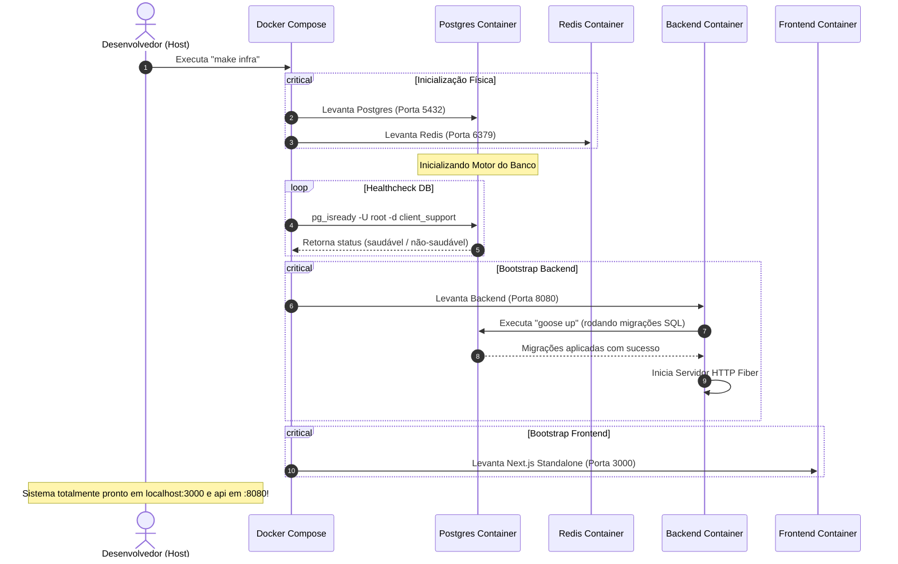
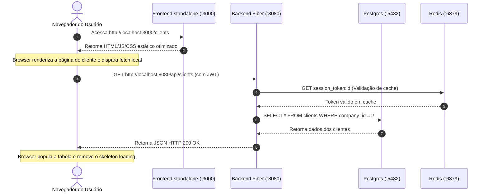

# Flow Specification: Containerização de Frontend e Backend

Este documento mapeia visual e conceitualmente os fluxos de inicialização do sistema orquestrado (Bootstrap Sequence) e o fluxo de requisição do usuário na arquitetura containerizada.

---

## 1. Fluxo de Inicialização do Sistema (Bootstrap Sequence)

O diagrama abaixo especifica a ordem correta de inicialização dos containers e a verificação de saúde antes que a aplicação esteja totalmente pronta para uso.

---

## 2. Fluxo de Requisição e Comunicação de Rede

O diagrama abaixo descreve a comunicação física de rede durante a interação do usuário final com a aplicação no browser:

