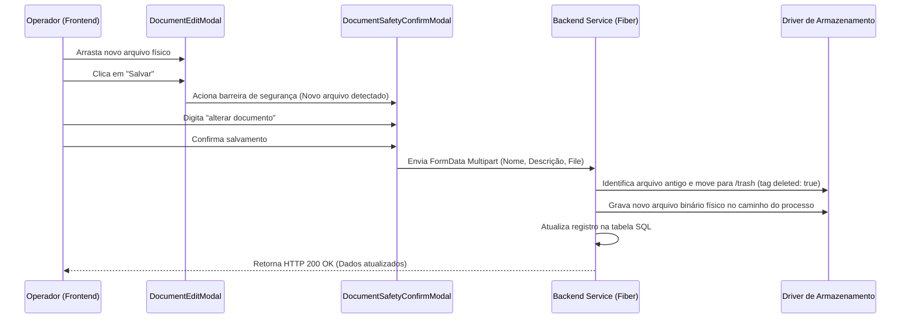
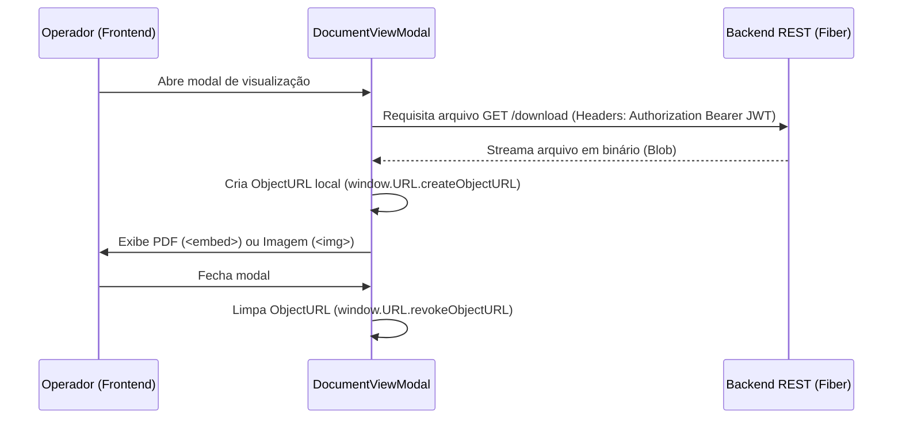

# FLOW_SPEC.md - Fluxos de Interações

## 1. Fluxo de Edição / Substituição de Arquivo

```mermaid
sequenceDiagram
    participant User as Operador (Frontend)
    participant ModalEdit as DocumentEditModal
    participant ModalSafety as DocumentSafetyConfirmModal
    participant API as Backend Service (Fiber)
    participant Storage as Driver de Armazenamento

    User->>ModalEdit: Arrasta novo arquivo físico
    User->>ModalEdit: Clica em "Salvar"
    ModalEdit->>ModalSafety: Aciona barreira de segurança (Novo arquivo detectado)
    User->>ModalSafety: Digita "alterar documento"
    User->>ModalSafety: Confirma salvamento
    ModalSafety->>API: Envia FormData Multipart (Nome, Descrição, File)
    API->>Storage: Identifica arquivo antigo e move para /trash (tag deleted: true)
    API->>Storage: Grava novo arquivo binário físico no caminho do processo
    API->>API: Atualiza registro na tabela SQL
    API-->>User: Retorna HTTP 200 OK (Dados atualizados)
```

---

## 2. Fluxo de Visualização Segura

```mermaid
sequenceDiagram
    participant User as Operador (Frontend)
    participant ModalView as DocumentViewModal
    participant API as Backend REST (Fiber)

    User->>ModalView: Abre modal de visualização
    ModalView->>API: Requisita arquivo GET /download (Headers: Authorization Bearer JWT)
    API-->>ModalView: Streama arquivo em binário (Blob)
    ModalView->>ModalView: Cria ObjectURL local (window.URL.createObjectURL)
    ModalView->>User: Exibe PDF (<embed>) ou Imagem (<img>)
    User->>ModalView: Fecha modal
    ModalView->>ModalView: Limpa ObjectURL (window.URL.revokeObjectURL)
```
