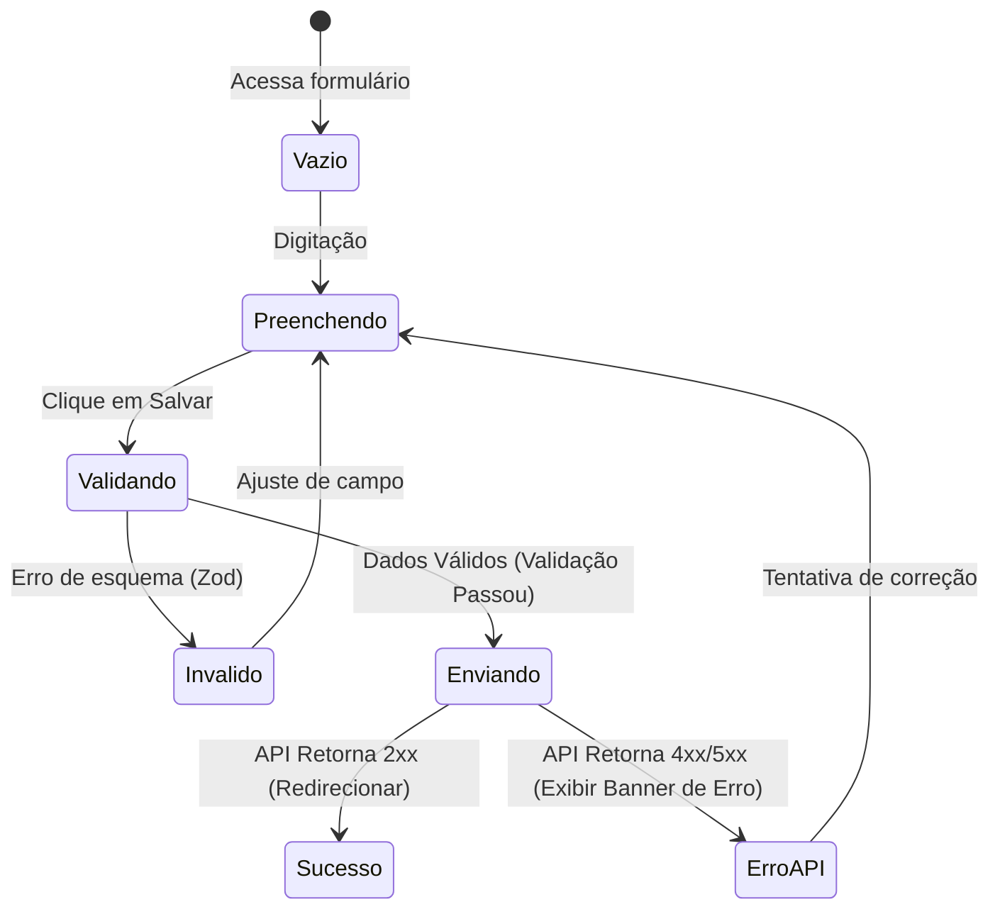

# Domain Specification — Alinhamento de Páginas de Formulário

Este documento descreve as entidades de visão, agregados e as regras de domínio aplicadas no ciclo de vida dos formulários do sistema.

---

## 1. Agregados de Formulário no Frontend

No contexto do frontend, os formulários operam como agregadores de estado que mapeiam campos de entrada aos modelos de dados de domínio do negócio. Os principais domínios afetados são:

### A. Domínio de Clientes (Client Aggregate)
- **Modelo de Visão (Form State)**:
  - `full_name`: String (Obrigatório, min 3 letras).
  - `email`: String (Opcional, formato de e-mail válido).
  - `phone`: String (Opcional, apenas números mapeados via máscara).
  - `birth_date`: ISO Date String (Opcional, formato YYYY-MM-DD).
  - `cpf`: String (Opcional, 11 dígitos numéricos validados pelo algoritmo de módulo 11).
  - `rg`: String (Opcional).
  - `cnh`: String (Opcional).
  - `status`: Enum ('ACTIVE', 'INACTIVE', 'SUSPENDED').

### B. Domínio de Processos (Process Aggregate)
- **Modelo de Visão (Form State)**:
  - `client_ids`: Array de Strings (Obrigatório, deve conter pelo menos 1 ID de cliente ativo).
  - `establishment_id`: String (Obrigatório).
  - `user_id`: String (Obrigatório, representa o operador responsável).
  - `protocol`: String (Opcional, identificador único externo).
  - `status`: Enum ('PENDING', 'IN_PROGRESS', 'AWAITING_DOCUMENTATION', 'IN_ANALYSIS', 'COMPLETED', 'CANCELLED').
  - `observation`: String (Opcional, limite de 4000 caracteres).

---

## 2. Regras de Transição de Estado

- **Bloqueio de Mutação de Estado**: Durante o estado `Enviando`, a entidade agregada do formulário entra em modo de somente leitura (`readonly`). Nenhuma alteração manual nos valores pode ocorrer.
- **Validação Antecipada**: A transição para o estado `Enviando` requer a verificação bem-sucedida do esquema Zod. Caso contrário, o estado reverte para `Invalido`, expondo as mensagens de erro localmente.
