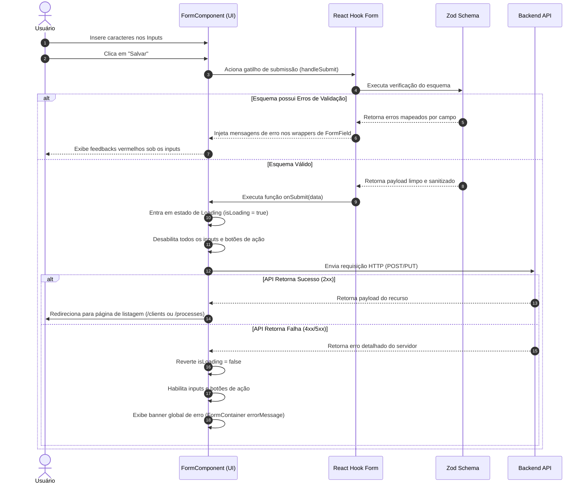

# Flow Specification — Alinhamento de Páginas de Formulário

Este documento descreve os fluxos de interação do usuário ao manipular e submeter formulários no sistema.

---

## 1. Fluxo de Validação e Submissão Assíncrona

---

## 2. Comportamento Acessível do Fluxo

- **Foco no Primeiro Erro**: Quando a validação falha no lado do cliente, o cursor do teclado (`focus`) deve se mover automaticamente para o primeiro campo de input inválido detectado, aumentando a acessibilidade por leitores de tela e navegação por teclado.
- **Prevenção de Fugas**: Durante a submissão, pressionar a tecla `Enter` ou clicar em qualquer elemento do formulário deve ser interceptado e ignorado, garantindo a atomicidade da requisição HTTP em andamento.
