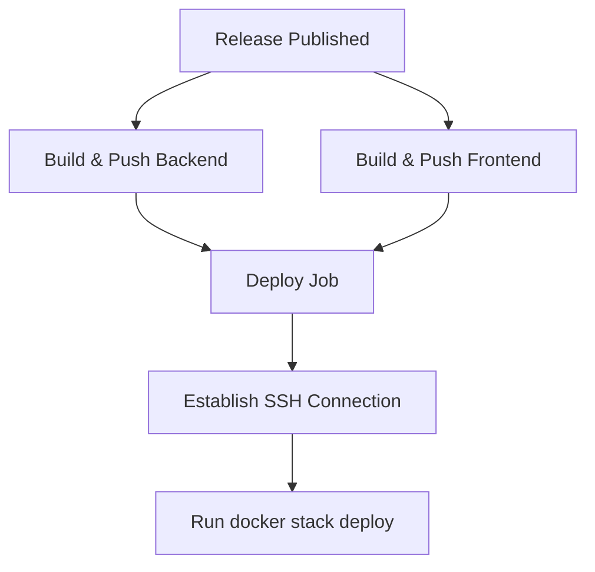

# Flow Spec: GitHub Actions SSH Deployment

```mermaid
graph TD
    A[Release Published] --> B[Build & Push Backend]
    A --> C[Build & Push Frontend]
    B --> D[Deploy Job]
    C --> D[Deploy Job]
    D --> E[Establish SSH Connection]
    E --> F[Run docker stack deploy]
```
