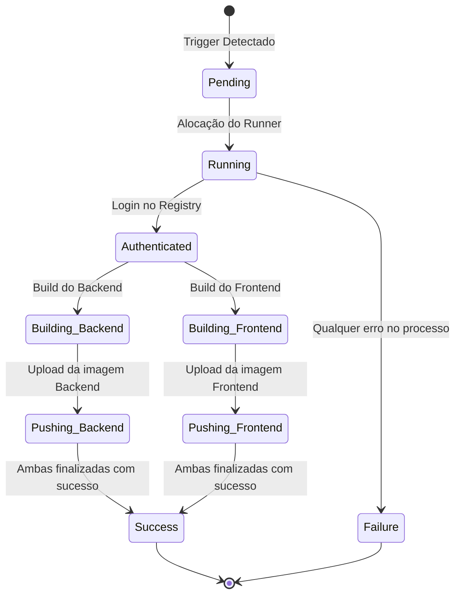

# Domain Specification: GitHub Actions para Build e Push de Imagens Docker

Este documento descreve as entidades de infraestrutura, os "Value Objects" do pipeline, as regras de segurança e o gerenciamento de estados do fluxo de CI/CD.

---

## 1. Entidades de Infraestrutura (Conceituais)

Apesar de ser uma feature de infraestrutura, podemos modelar o fluxo em entidades e conceitos que regem o ciclo de publicação de imagens:

### 1.1. Artefato de Build (Image Artifact)
* **Atributos**:
  * `registry`: Endereço do registry privado (`registry.advocase.site`).
  * `namespace`: Caminho de organização (`client-support`).
  * `name`: Nome do serviço (`backend` ou `app`).
  * `tag`: Versão da imagem (`latest` e/ou short SHA do commit).

### 1.2. Pipeline Run (Execução do Workflow)
* **Atributos**:
  * `trigger`: Gatilho (`push`, `pull_request`, `workflow_dispatch`).
  * `status`: Estado atual (`queued`, `in_progress`, `success`, `failure`, `cancelled`).
  * `commit_sha`: Hash do commit do Git que disparou a build.

---

## 2. Segredos do Repositório (Credentials / Value Objects)

Para autenticação segura no registry privado:
* **REGISTRY_USERNAME**: Usuário autorizado no registry privado da Advocase.
* **REGISTRY_PASSWORD**: Token ou senha associada ao usuário para permissão de escrita/leitura.
* **NEXT_PUBLIC_API_URL**: URL da API que será embutida no frontend em tempo de compilação (Next.js).

---

## 3. Estados do Pipeline de Publicação

A execução do pipeline segue um ciclo de estados bem definido:

