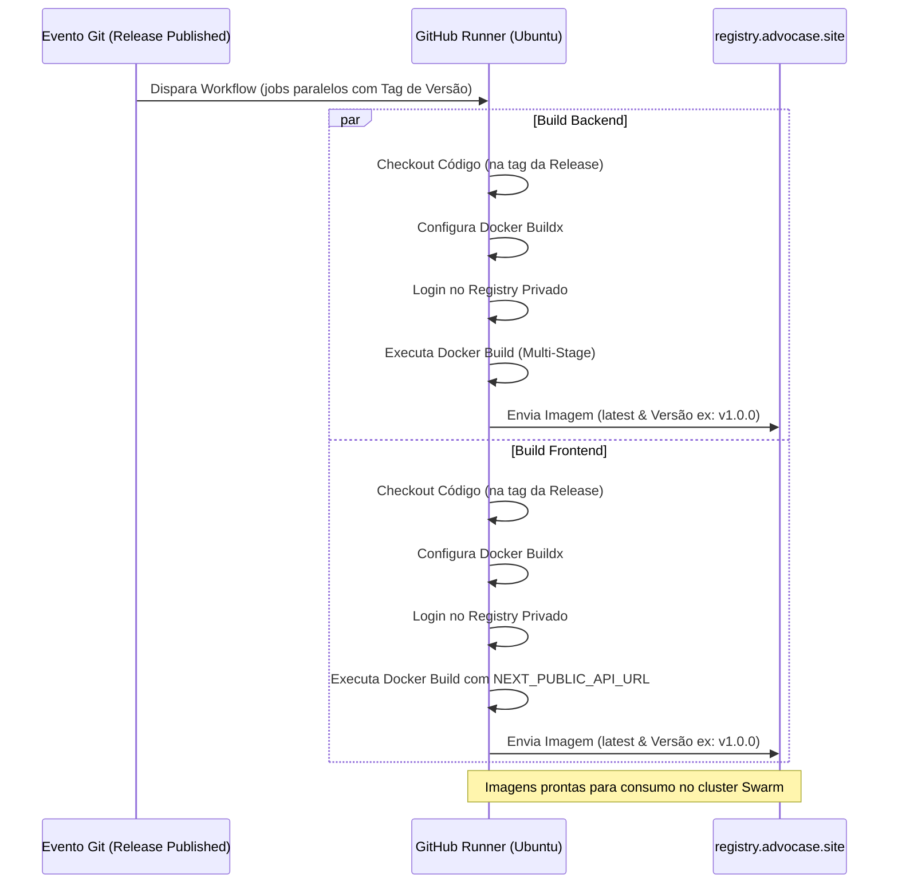

# Flow Specification: GitHub Actions para Build e Push de Imagens Docker

Este documento descreve detalhadamente a sequência de etapas e a execução do workflow de CI/CD para compilação e publicação de imagens de containers ao fechar uma release.

---

## 1. Fluxo de Execução do Pipeline

A execução do pipeline segue um fluxo estrito e otimizado:

---

## 2. Tratamento de Falhas

Se ocorrer qualquer falha durante as etapas de build ou push (como credenciais inválidas, erros de sintaxe nos Dockerfiles, ou indisponibilidade do registry):
1. O pipeline é interrompido imediatamente para o job falho.
2. O status do commit/tag no GitHub é atualizado para `Failed`.
3. O status do job é reportado na aba "Actions", permitindo a visualização detalhada dos logs do Docker Build.
