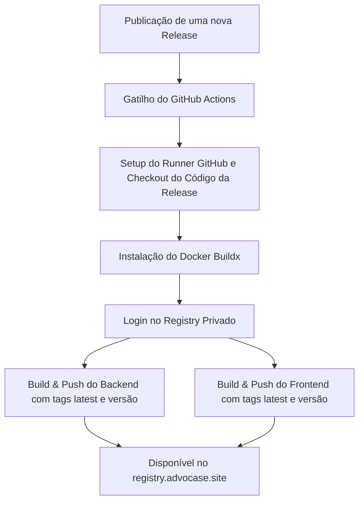

# Product Specification: GitHub Actions para Build e Push de Imagens Docker

Este documento descreve os objetivos de negócio, requisitos não-funcionais, regras e critérios de aceite para a automação da build e publicação das imagens de contêiner no registry de imagens privado `registry.advocase.site`.

---

## 1. Objetivos da Feature

O objetivo principal desta feature é automatizar o ciclo de entrega contínua (CI/CD) para as imagens Docker do frontend e backend da plataforma **Client Support Hub**.

### Objetivos Específicos:
* **Automação de Build & Push**: Eliminar o processo manual de compilar e subir imagens no terminal do desenvolvedor local.
* **Consistência de Artefatos**: Garantir que as imagens Docker sejam geradas a partir do código de releases consolidadas no repositório remoto.
* **Prontidão de Deploy**: Permitir que, ao fechar e publicar uma release, o cluster Docker Swarm de produção tenha imagens atualizadas prontas para serem obtidas via `docker stack deploy --with-registry-auth`.

---

## 2. Requisitos Não-Funcionais e Critérios de Aceite

| ID | Requisito / Critério de Aceite | Detalhe Técnico |
|---|---|---|
| **RF-01** | Gatilhos de Execução | O pipeline de build deve ser executado no fechamento/publicação de uma release no GitHub (`release` com tipo `published`). |
| **RF-02** | Autenticação no Registry | A Action deve autenticar de forma segura no registry privado `registry.advocase.site` usando secrets do repositório (`REGISTRY_USERNAME`, `REGISTRY_PASSWORD`). |
| **RF-03** | Build e Push do Backend | Compilar o backend em ambiente Linux e enviar a imagem final para `registry.advocase.site/client-support/backend:<versão_da_release>` e `registry.advocase.site/client-support/backend:latest`. |
| **RF-04** | Build e Push do Frontend | Compilar o frontend Next.js passando o argumento `--build-arg NEXT_PUBLIC_API_URL` com valor configurado, e enviar a imagem final para `registry.advocase.site/client-support/app:<versão_da_release>` e `registry.advocase.site/client-support/app:latest`. |
| **RF-05** | Cache de Layers Docker | Utilizar o cache do GitHub Actions para otimizar o tempo de build das camadas Docker (Docker Layer Caching). |
| **RF-06** | Versionamento por Versão da Release | As imagens construídas devem ser obrigatoriamente tagueadas com a tag exata da release associada (ex: `v1.0.1`), além do marcador `latest` que apontará para a última versão estável publicada. |

---

## 3. Regras de Negócio e Infraestrutura

1. **Segurança de Credenciais**:
   * As chaves e usuários de acesso ao registro `registry.advocase.site` **não** devem estar expostos no código da action. Devem ser obrigatoriamente lidos do repositório via Secrets (`${{ secrets.REGISTRY_USERNAME }}` e `${{ secrets.REGISTRY_PASSWORD }}`).
2. **Ambiente de Build do Frontend**:
   * O build do frontend precisa da URL da API produtiva. Essa URL deve ser flexível e definida usando variáveis do repositório ou um fallback padrão configurado (ex: `https://api.advocase.site/api`).

---

## 4. Fluxo Funcional do Pipeline

