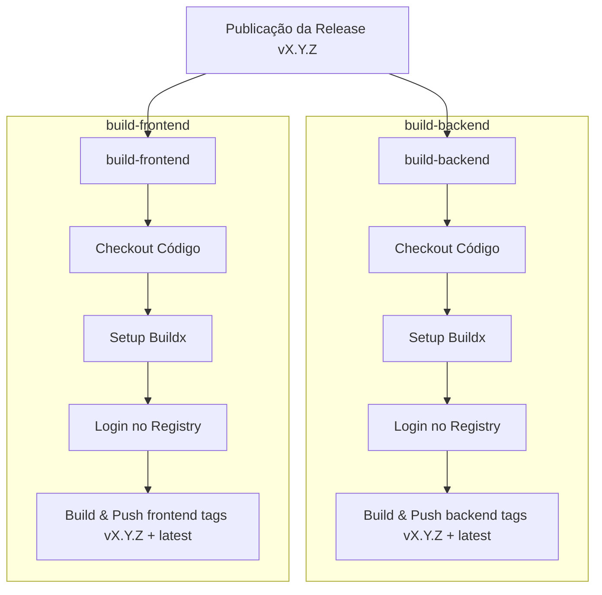

# Technical Specification: GitHub Actions para Build e Push de Imagens Docker

Este documento detalha os aspectos técnicos da implementação da GitHub Action para compilar e subir imagens para o registry privado `registry.advocase.site`.

---

## 1. Arquitetura do Workflow

O workflow será implementado na raiz do projeto em `.github/workflows/docker-build-push.yml`.

### Ferramentas e Actions Utilizadas:
* **Runner**: `ubuntu-latest` (oferece Docker pré-instalado e compatibilidade total com actions oficiais).
* **actions/checkout@v3**: Para clonar o repositório no runner.
* **docker/setup-buildx-action@v2**: Configura o Docker Buildx, que possibilita build multi-plataforma e cache avançado.
* **docker/login-action@v2**: Autentica no registry privado.
* **docker/build-push-action@v4**: Constrói e envia as imagens Docker utilizando Buildx.

---

## 2. Estrutura do Workflow

### Gatilhos (`on`):
* `release`:
  * Types: `[ published ]`

### Extração da Tag de Versão:
O pipeline identificará o nome da tag que disparou a build a partir da variável `${{ github.event.release.tag_name }}`. O pipeline gerará duas tags no registry:
1. `registry.advocase.site/client-support/<service>:${{ github.event.release.tag_name }}`
2. `registry.advocase.site/client-support/<service>:latest`

### Definição dos Jobs:
O workflow conterá dois jobs paralelos para otimizar o tempo total de execução:
1. **build-backend**: Focado na compilação e publicação da imagem do Go.
2. **build-frontend**: Focado na compilação e publicação da imagem Next.js.



---

## 3. Otimização e Cache (Docker Layer Caching)

Para evitar re-download e compilação de camadas inalteradas, utilizaremos o recurso de cache integrado da action `docker/build-push-action` apontando para o cache do GitHub Actions (`type=gha`):
```yaml
cache-from: type=gha
cache-to: type=gha,mode=max
```
Isso acelera consideravelmente os builds subsequentes.

---

## 4. Variáveis de Build (Build-Args)

* **Backend**: Nenhuma build-arg obrigatória no momento do build (configuração feita via variáveis de ambiente no runtime).
* **Frontend**:
  * `NEXT_PUBLIC_API_URL`: Definida em build-time. Valor padrão a ser passado: `${{ secrets.NEXT_PUBLIC_API_URL || 'https://api.advocase.site/api' }}`.
