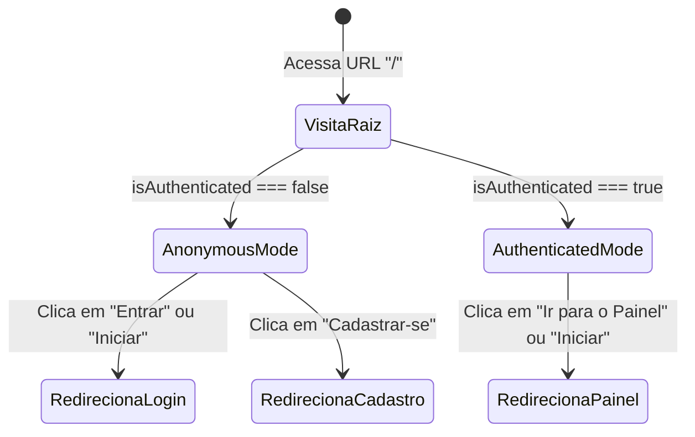

# Domain Specification: Landing Page

Este documento define o modelo de domínio, estados da aplicação e regras de bounded context aplicados à landing page do sistema **SuporteCliente**.

---

## 1. Bounded Context e Agregados

A landing page opera na borda pública da aplicação. Ela não manipula agregados transacionais diretamente (como `Client` ou `Process`), mas atua como direcionadora de fluxos baseada no estado do agregado de Sessão do Usuário.

### Estados de Sessão Relevantes

* **`AnonymousSession`**:
  * Caracterizado por: `isAuthenticated = false` e `accessToken = null`.
  * Ações permitidas na UI: Acessar login, registrar-se, visualizar recursos públicos.
* **`AuthenticatedSession`**:
  * Caracterizado por: `isAuthenticated = true` e `accessToken != null`.
  * Ações permitidas na UI: Navegar diretamente para o painel administrativo, pular o fluxo de login/cadastro.

---

## 2. Regras de Transição de Estado

---

## 3. Estado de UI local

A página de landing page utilizará o estado global do Redux Toolkit (`authStore`) para ler o valor de `isAuthenticated` e determinar quais componentes interativos do cabeçalho e da seção hero exibir.

* **`loading`**: Estado temporário durante a leitura inicial do localStorage/sessionStorage para evitar flashes indesejados de layout (UI flickering).
* **`theme`**: Suporte ao esquema de cores padrão definido nas variáveis CSS globais.
