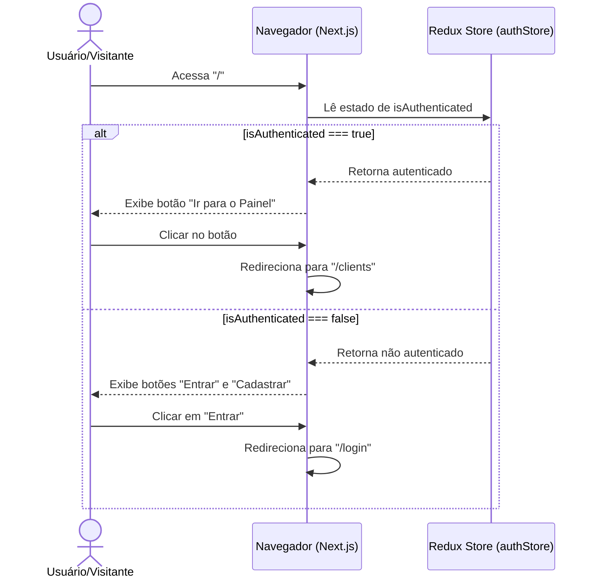

# Flow Specification: Landing Page

Este documento mapeia os fluxos do usuário a partir do acesso à raiz da aplicação.

---

## 1. Fluxo do Visitante Não Autenticado (Anônimo)

1. **Acesso**: O usuário acessa a raiz `http://localhost:3000/`.
2. **Identificação**: O sistema inicializa e verifica a Redux Store (`authStore`), identificando `isAuthenticated = false`.
3. **Renderização**:
   * O Header público exibe os botões "Entrar" e "Cadastrar".
   * A seção Hero exibe o botão "Iniciar Agora" que aponta para `/register`.
4. **Interação**:
   * Clicar em "Entrar" -> Redireciona para `/login`.
   * Clicar em "Cadastrar" ou "Iniciar Agora" -> Redireciona para `/register`.

---

## 2. Fluxo do Usuário Autenticado

1. **Acesso**: O usuário autenticado (ou com token válido no localStorage) acessa a raiz `/`.
2. **Identificação**: O Redux Store é carregado, identificando `isAuthenticated = true`.
3. **Renderização**:
   * O Header público exibe o botão "Ir para o Painel".
   * A seção Hero altera o CTA para "Ir para o Painel" (apontando para `/clients`).
4. **Interação**:
   * Clicar em qualquer botão de CTA administrativo -> Redireciona para `/clients`.

---

## 3. Navegação Programática

