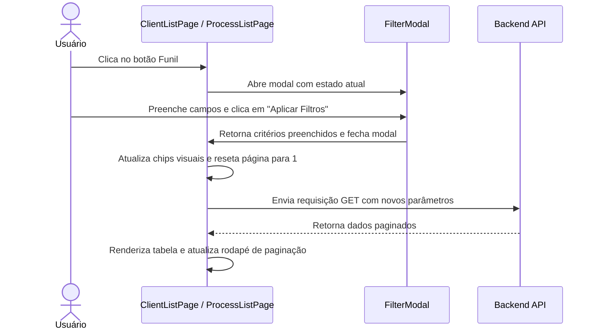
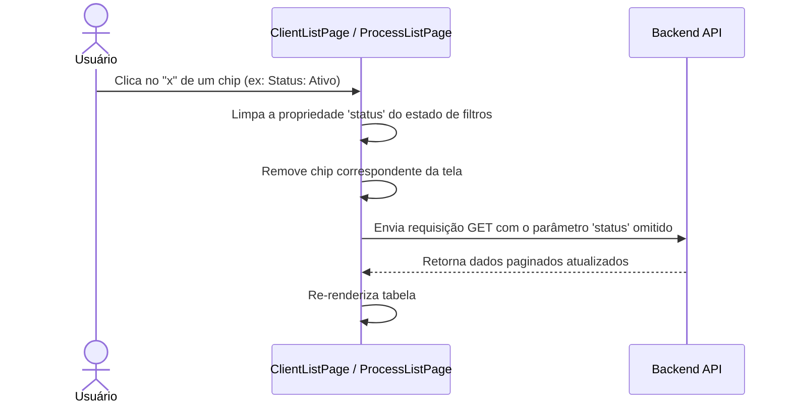

# Flow Specification — Alinhamento da Página de Listagem

Este documento descreve as sequências de interação do usuário para filtragem, busca e navegação na página de listagem.

---

## 1. Fluxo de Filtros por Modal

---

## 2. Fluxo de Remoção de Chip Individual

