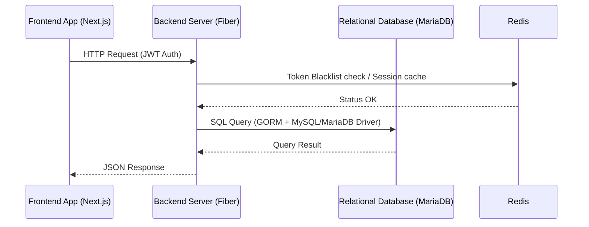
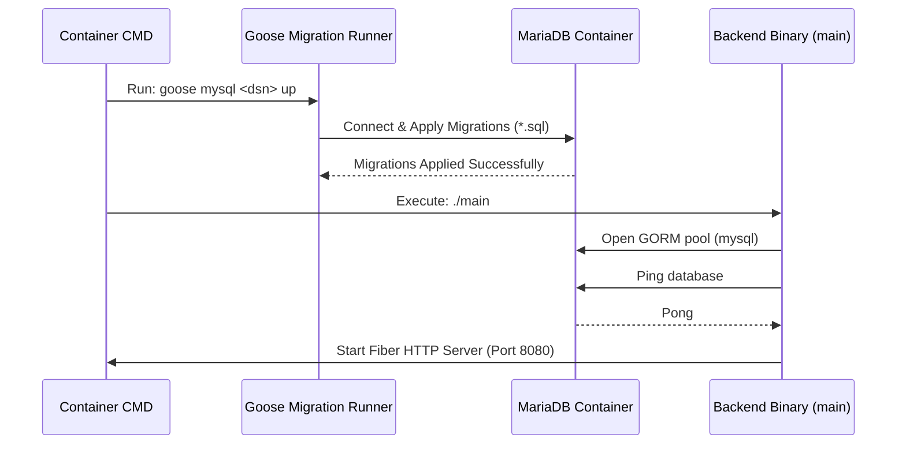

# Flow Specification - MariaDB Migration

## System Flows
All data flows (authentication, client operations, process handling, annotations, documents) remain unchanged:

## Migration & Startup Flow
At container startup, the backend initialization flow executes migrations and connects to the database:

