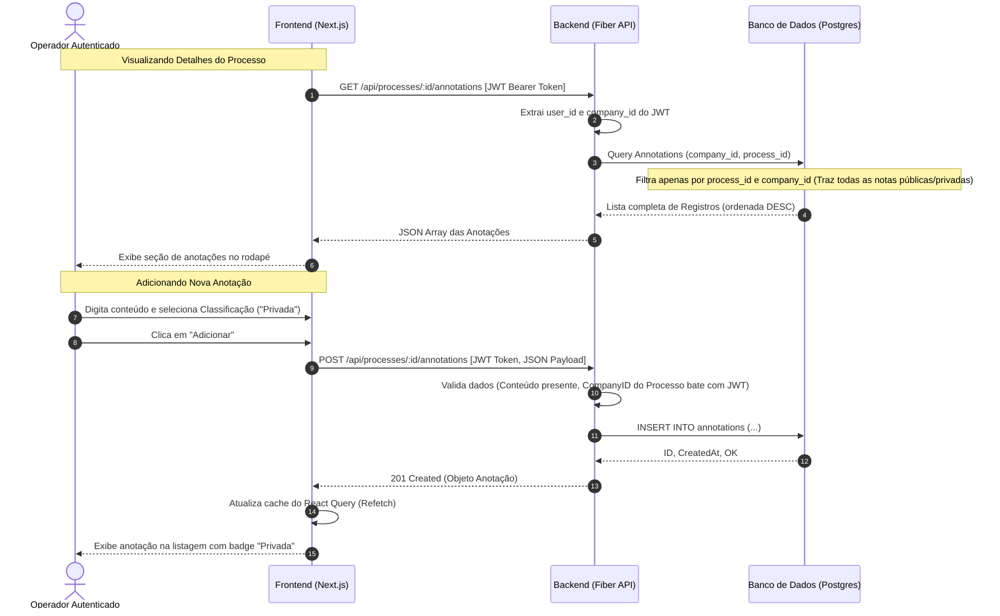
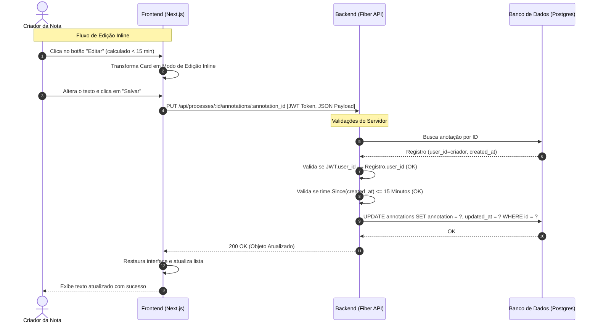

# Flow Specification: Process Annotations

Este documento apresenta a modelagem de fluxo do sistema e as interações entre o Frontend, o Backend e a Camada de Banco de Dados.

---

## 1. Fluxo de Criação e Consulta de Anotações

O diagrama abaixo ilustra o fluxo de carregamento dos detalhes do processo, exibição das notas públicas/privadas autorizadas e criação de uma nova nota.

---

## 2. Fluxo de Edição ou Exclusão (Regra dos 15 Minutos)

Este diagrama detalha as validações efetuadas para garantir que apenas o criador de uma nota possa alterá-la ou removê-la, e unicamente dentro da janela dos 15 minutos regulamentares.

