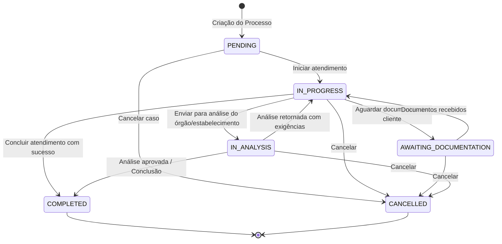

# Domain Specification: Process CRUD

Este documento define os agregados, entidades, regras de domínio e transições de estado associados à gestão de Processos e Estabelecimentos.

---

## 1. Modelo de Domínio (Entidades e Agregados)

### 1.1. Entidade Raiz do Agregado: `Process` (Processo)
Representa o caso de atendimento em si. Controla a integridade de seus status, protocolo e associações.

* **Atributos**:
  * `ID`: Identificador Único (`uuid.UUID`).
  * `CompanyID`: Identificador da Empresa (`uuid.UUID`) - *Partition Key*.
  * `Protocol`: Número do protocolo opcional (`*string`).
  * `Observation`: Notas e observações de acompanhamento do caso (`*string`).
  * `Status`: Estado atual do processo (`ProcessStatus`).
  * `EstablishmentID`: Identificador do local do atendimento (`uuid.UUID`).
  * `Establishment`: Entidade rica `Establishment`.
  * `UserID`: Identificador do Usuário Responsável (`uuid.UUID`).
  * `User`: Entidade rica `User` (Responsável).
  * `Clients`: Lista de Clientes vinculados (`[]Client`).
  * `CreatedAt`: Timestamp de criação (`time.Time`).
  * `UpdatedAt`: Timestamp da última modificação (`time.Time`).

### 1.2. Entidade: `Establishment` (Estabelecimento)
Representa o local físico ou instituição de atendimento público/privado onde o processo se desenvolve.

* **Atributos**:
  * `ID`: Identificador Único (`uuid.UUID`).
  * `CompanyID`: Identificador da Empresa (`uuid.UUID`) - *Partition Key*.
  * `Name`: Nome fantasia ou Razão Social do estabelecimento (`string`).
  * `Address`: Endereço completo (Rua, número, complemento, bairro) (`string`).
  * `City`: Cidade (`string`).
  * `State`: Estado - UF de 2 dígitos (`string`).
  * `CreatedAt`: Timestamp de criação (`time.Time`).
  * `UpdatedAt`: Timestamp da última modificação (`time.Time`).

### 1.3. Entidade Associativa: `ClientProcess` (Vínculo Cliente-Processo)
Entidade de junção para mapear o relacionamento N:N entre clientes e processos.

* **Atributos**:
  * `ID`: Identificador Único (`uuid.UUID`).
  * `ClientID`: Identificador do Cliente (`uuid.UUID`).
  * `ProcessID`: Identificador do Processo (`uuid.UUID`).

---

## 2. Transições e Máquina de Estado do Processo

O status de um processo governa seu ciclo de vida. As transições de status são livres, permitindo ajustes flexíveis de acordo com a evolução do caso.

### Valores de Status Válidos:
1. `PENDING`: Processo criado e aguardando triagem ou início.
2. `IN_PROGRESS`: Processo em andamento/execução ativa.
3. `AWAITING_DOCUMENTATION`: Paralisado aguardando o envio de documentos solicitados ao cliente.
4. `IN_ANALYSIS`: Processo enviado e em análise interna ou externa (ex: órgão público ou parceiro).
5. `COMPLETED`: Processo finalizado com sucesso.
6. `CANCELLED`: Processo cancelado e arquivado sem conclusão.

---

## 3. Regras de Validação do Domínio

### 3.1. Validações na Criação do Processo
* **Clientes Obrigatórios**: Deve haver pelo menos 1 cliente na lista de associações.
* **Coerência de Empresa (Tenant Isolation)**:
  * O `CompanyID` do Processo, do `Establishment`, do `User` (Responsável) e de todos os `Clients` associados **deve** ser rigorosamente o mesmo.
* **Status dos Recursos**:
  * O Responsável (`User`) deve estar ativo (`UserStatusActive`).
  * Todos os `Clients` associados devem estar ativos (`ClientStatusActive`).

### 3.2. Validações no Estabelecimento
* **Nome**: Obrigatório, mínimo de 3 caracteres.
* **Endereço**: Obrigatório, mínimo de 5 caracteres.
* **Cidade**: Obrigatório, mínimo de 2 caracteres.
* **Estado (UF)**: Obrigatório, deve conter exatamente 2 caracteres (ex: "SP", "RJ", "MG").
