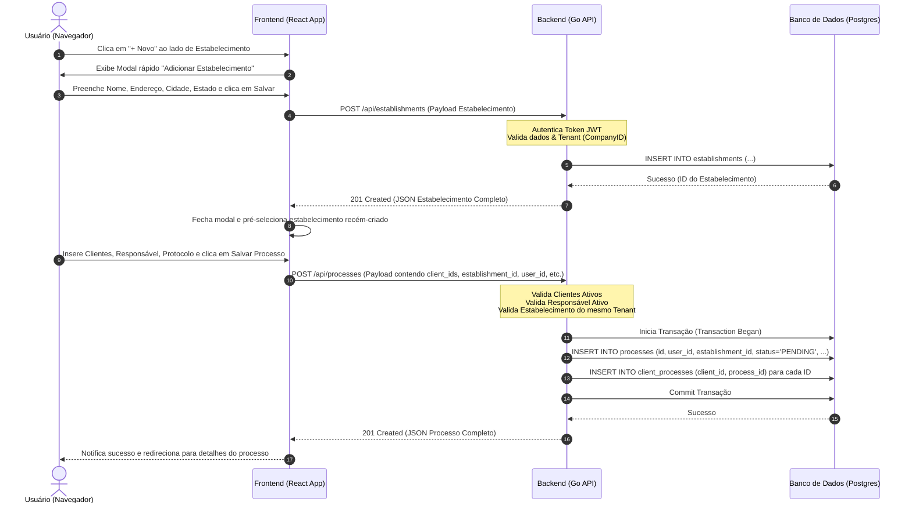
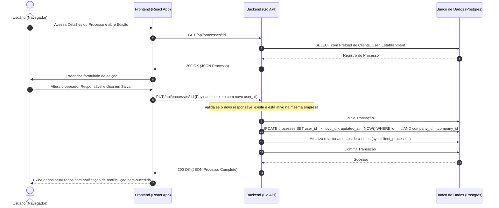

# Flow Specification: Process CRUD

Este documento descreve os fluxos de controle e sequenciamento de interações entre o Frontend, o Backend e o Banco de Dados para os casos de uso críticos de Processos.

---

## 1. Fluxo de Criação de Processo com Criação Inline de Estabelecimento

Este diagrama de sequência descreve o cenário em que o usuário preenche o formulário de processo, percebe a falta do estabelecimento, cria-o de forma inline e depois submete o processo com sucesso.

---

## 2. Fluxo de Edição / Reatribuição de Responsável

