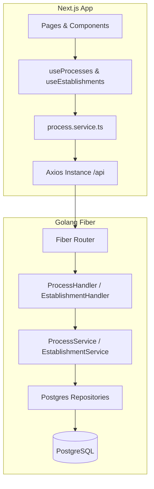

# Technical Specification: Process CRUD

Este documento especifica a arquitetura técnica, divisão de camadas, módulos e estratégias de persistência e integração para a feature de Gestão de Processos.

---

## 1. Visão Geral da Arquitetura Técnica

A implementação seguirá estritamente a arquitetura limpa (Clean Architecture) e o isolamento de domínio (Multitenancy) já estabelecidos no projeto.



---

## 2. Backend (Go - Clean Architecture)

### 2.1. Camada de Domínio (`backend/internal/domain/`)
* **`process.go`**:
  * Atualizar o enum `ProcessStatus` com os novos valores: `PENDING`, `IN_PROGRESS`, `AWAITING_DOCUMENTATION`, `IN_ANALYSIS`, `COMPLETED`, `CANCELLED`.
  * Atualizar a struct `Process` para remover a associação direta N:1 com `Client` (remover `ClientID`, `Client` fields da struct, ou mantê-los se necessário para compatibilidade, mas o correto é criar um array de clientes `Clients []Client gorm:"many2many:client_processes;"`).
  * Adicionar `Protocol *string` e `Observation *string` à struct `Process`.
  * Adicionar `EstablishmentID uuid.UUID` e `Establishment Establishment` à struct `Process`.
  * Atualizar a interface `ProcessRepository` com os métodos necessários:
    ```go
    type ProcessRepository interface {
        Create(process *Process) error
        FindByIDAndCompany(id uuid.UUID, companyID uuid.UUID) (*Process, error)
        FindAll(companyID uuid.UUID, clientID *uuid.UUID, userID *uuid.UUID, status string, protocol string, page int, limit int) ([]*Process, int, error)
        Update(process *Process) error
        Delete(id uuid.UUID, companyID uuid.UUID) error
    }
    ```
* **`establishment.go` [NEW]**:
  * Declarar a struct `Establishment`:
    ```go
    package domain

    import (
        "time"
        "github.com/google/uuid"
    )

    type Establishment struct {
        ID        uuid.UUID `json:"id" gorm:"type:uuid;primary_key;default:uuid_generate_v4()"`
        CompanyID uuid.UUID `json:"company_id" gorm:"type:uuid;not null"`
        Company   Company   `json:"company" gorm:"foreignKey:CompanyID"`
        Name      string    `json:"name" gorm:"type:varchar(255);not null"`
        Address   string    `json:"address" gorm:"type:text;not null"`
        City      string    `json:"city" gorm:"type:varchar(100);not null"`
        State     string    `json:"state" gorm:"type:varchar(2);not null"`
        CreatedAt time.Time `json:"created_at"`
        UpdatedAt time.Time `json:"updated_at"`
    }

    type EstablishmentRepository interface {
        Create(est *Establishment) error
        FindByIDAndCompany(id uuid.UUID, companyID uuid.UUID) (*Establishment, error)
        FindAll(companyID uuid.UUID, search string, page int, limit int) ([]*Establishment, int, error)
        Update(est *Establishment) error
        ExistsByNameAndCompany(name string, companyID uuid.UUID, excludeID *uuid.UUID) (bool, error)
    }
    ```

### 2.2. Camada de Repositório (`backend/internal/repository/postgres/`)
* **`process_repository.go`**:
  * Atualizar as consultas para utilizar GORM preload de `Clients`, `Establishment` e `User`.
  * Utilizar `db.Transaction` ou recursos nativos do GORM para gerenciar a tabela de associação many2many (`client_processes`) de forma atômica na criação e atualização.
* **`establishment_repository.go` [NEW]**:
  * Implementação concreta de `EstablishmentRepository` utilizando GORM.

### 2.3. Camada de Serviço (`backend/internal/service/`)
* **`process.go`**:
  * Validar regras de negócio na criação/edição de processos (existência de clientes ativos, operador ativo pertencente ao mesmo tenant e estabelecimento).
* **`establishment.go` [NEW]**:
  * Serviço de validação e persistência de locais de atendimento, incluindo validação de duplicidade por nome na mesma empresa.

### 2.4. Camada de Handlers/HTTP (`backend/internal/handlers/http/`)
* **`process_handler.go`**:
  * Atualizar DTOs `CreateProcessRequest` e `UpdateProcessRequest` para aceitar `client_ids []string`, `establishment_id string` e demais campos.
* **`establishment_handler.go` [NEW]**:
  * Endpoints para listar e criar estabelecimentos.

---

## 3. Frontend (React + Next.js App Router)

A implementação no frontend seguirá a divisão modular por features de negócio:
* **Features Folder**: `app/src/features/processes/` [NEW]
  * **`components/`**: Modais, formulários (`ProcessForm.tsx`), autocomplete de estabelecimento e listagem de clientes.
  * **`hooks/`**: `useProcesses.ts` para encapsular chamadas de API, estados de carregamento e paginação.
  * **`pages/`**: Páginas de listagem, detalhes e criação/edição.
  * **`services/`**: `process.service.ts` e `establishment.service.ts` para requisições HTTP com Axios.
* **Interfaces Folder**: `app/src/interfaces/`
  * Adicionar `process.interface.ts` e `establishment.interface.ts`.
* **State / Store**: Utilizar hooks locais para estado de formulários e React Query / Redux se necessário, mantendo o estado local para evitar sobrecarga global.
