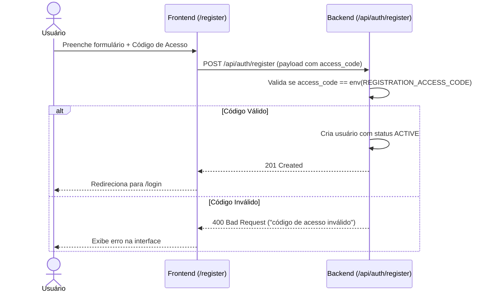
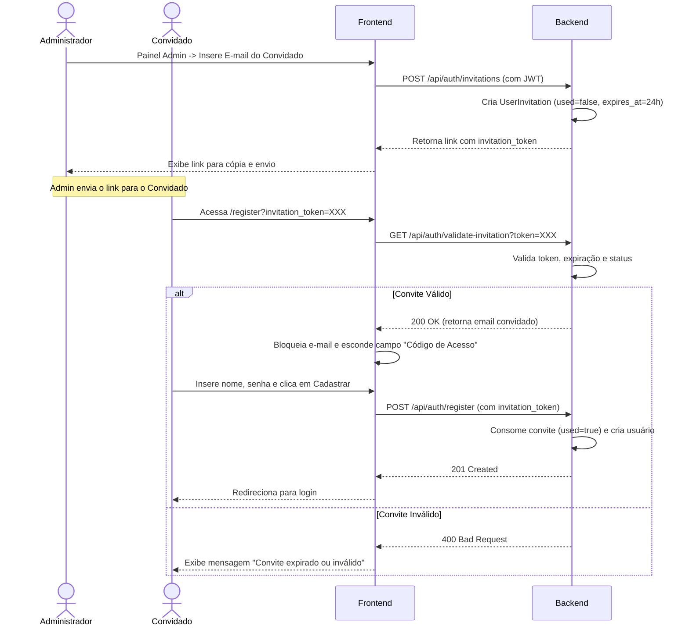

# FLOW SPECIFICATION (FLOW_SPEC.md) - Cadastro Seguro de Usuários

## Fluxos do Sistema

### 1. Fluxo de Registro via Código de Acesso

```mermaid
sequenceDiagram
    actor User as Usuário
    participant FE as Frontend (/register)
    participant BE as Backend (/api/auth/register)
    
    User->>FE: Preenche formulário + Código de Acesso
    FE->>BE: POST /api/auth/register (payload com access_code)
    BE->>BE: Valida se access_code == env(REGISTRATION_ACCESS_CODE)
    alt Código Válido
        BE->>BE: Cria usuário com status ACTIVE
        BE-->>FE: 201 Created
        FE-->>User: Redireciona para /login
    else Código Inválido
        BE-->>FE: 400 Bad Request ("código de acesso inválido")
        FE-->>User: Exibe erro na interface
    end
```

### 2. Fluxo de Registro via Convite de Administrador

```mermaid
sequenceDiagram
    actor Admin as Administrador
    actor Guest as Convidado
    participant FE as Frontend
    participant BE as Backend
    
    Admin->>FE: Painel Admin -> Insere E-mail do Convidado
    FE->>BE: POST /api/auth/invitations (com JWT)
    BE->>BE: Cria UserInvitation (used=false, expires_at=24h)
    BE-->>FE: Retorna link com invitation_token
    FE-->>Admin: Exibe link para cópia e envio
    
    Note over Admin, Guest: Admin envia o link para o Convidado
    
    Guest->>FE: Acessa /register?invitation_token=XXX
    FE->>BE: GET /api/auth/validate-invitation?token=XXX
    BE->>BE: Valida token, expiração e status
    alt Convite Válido
        BE-->>FE: 200 OK (retorna email convidado)
        FE->>FE: Bloqueia e-mail e esconde campo "Código de Acesso"
        Guest->>FE: Insere nome, senha e clica em Cadastrar
        FE->>BE: POST /api/auth/register (com invitation_token)
        BE->>BE: Consome convite (used=true) e cria usuário
        BE-->>FE: 201 Created
        FE-->>Guest: Redireciona para login
    else Convite Inválido
        BE-->>FE: 400 Bad Request
        FE-->>Guest: Exibe mensagem "Convite expirado ou inválido"
    end
```
